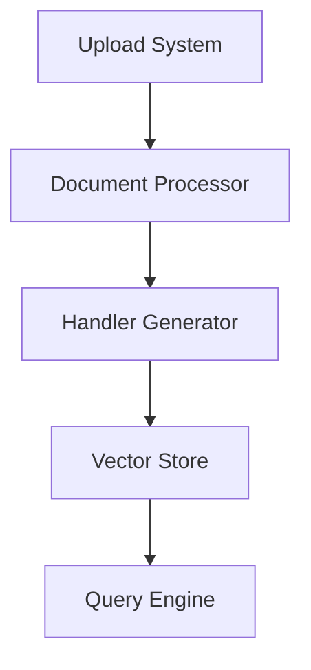

# Architektur der DialogEngine

## Überblick

Die DialogEngine ist ein modernes System zur automatischen Verarbeitung und Beantwortung von Benutzeranfragen. Die Architektur basiert auf einem flexiblen, skalierbaren Design mit folgenden Hauptkomponenten:



## Hauptkomponenten

### 1. Upload-System
- Dokumenten-Validierung
- Fortschritts-Tracking
- Fehlerbehandlung
- Sicherheitsmaßnahmen

### 2. Document Processor
- Inhaltsanalyse
- Metadaten-Extraktion
- Strukturerkennung
- Faktenextraktion

### 3. Handler Generator
- Automatische Handler-Generierung
- Schema-Generierung
- Template-Erstellung
- Antwortmuster-Analyse

### 4. Vector Store
- Pinecone Integration
- Chunk-Management
- Metadaten-Verknüpfung
- Optimierte Suche

### 5. Query Engine
- Anfrage-Analyse
- Kontext-Verarbeitung
- Antwort-Generierung
- Response-Formatierung

## Datenfluss

1. **Upload & Verarbeitung**
   ```mermaid
   sequenceDiagram
       User->>Upload: Dokument
       Upload->>Processor: Verarbeitung
       Processor->>Generator: Analyse
       Generator->>Store: Vektorisierung
   ```

2. **Anfrage & Antwort**
   ```mermaid
   sequenceDiagram
       User->>Engine: Anfrage
       Engine->>Store: Suche
       Store->>Engine: Relevante Chunks
       Engine->>User: Formatierte Antwort
   ```

## Technologie-Stack

- **Frontend**: Next.js, React, TailwindCSS
- **Backend**: Node.js, TypeScript
- **Datenbank**: PostgreSQL, Prisma
- **Vector Store**: Pinecone
- **KI**: OpenAI GPT-4

## Sicherheit & Performance

### Sicherheit
- Input-Validierung
- Authentifizierung
- Autorisierung
- Datenverschlüsselung

### Performance
- Caching-Strategien
- Lazy Loading
- Chunk-Optimierung
- Query-Optimierung

## Entwicklung & Deployment

### Entwicklung
- TypeScript
- ESLint
- Jest Tests
- Husky Hooks

### Deployment
- Docker Container
- CI/CD Pipeline
- Monitoring
- Logging

## Konfiguration

### Handler-Konfiguration
```typescript
interface HandlerConfig {
  id: string;
  type: string;
  metadata: HandlerMetadata;
  capabilities: string[];
  config: {
    patterns: string[];
    metadata: Record<string, any>;
    settings: HandlerSettings;
  }
}
```

### Template-Konfiguration
```typescript
interface TemplateConfig {
  patterns: string[];
  metadata: MetadataConfig[];
  responses: ResponseTemplate[];
}
```

## Monitoring & Wartung

### Monitoring
- Performance-Metriken
- Error-Tracking
- Usage-Analytics
- Health-Checks

### Wartung
- Automatische Updates
- Backup-Strategien
- Daten-Migration
- Schema-Updates 